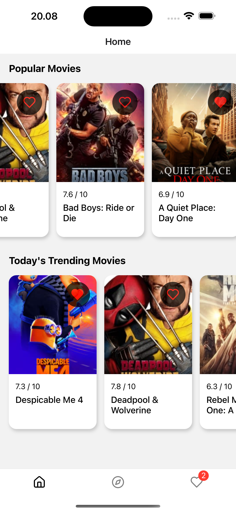
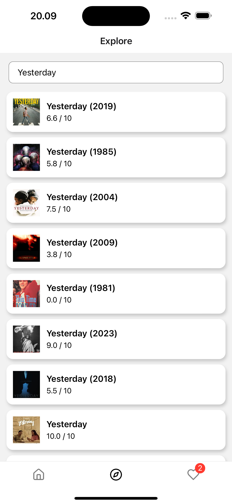
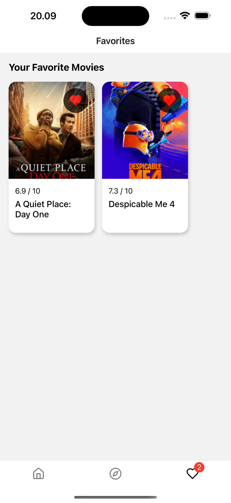
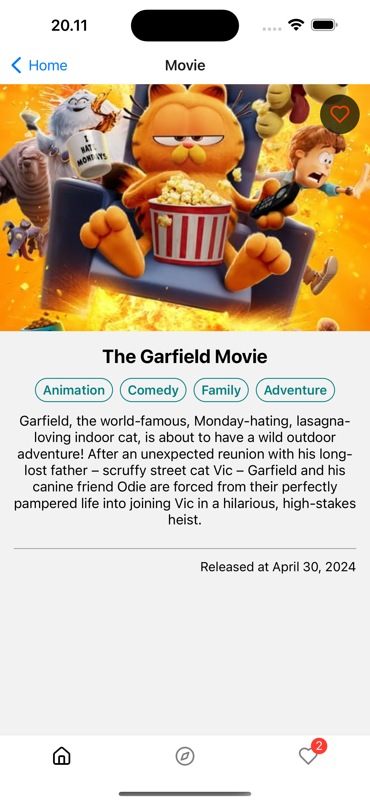

# YoMovie

Explore you favorite movies! - A cross-platform mobile application, it's running on Android & iOS.

## Requirements

- Node.js >= 20.10.0
- Yarn >= 3.6.4
- Cocoapods >= 1.14.3
- JDK 17

## Development Setup

### Clone the code from GitHub

```sh
git clone git@github.com:nuzulh/YoMovie.git
cd YoMovie
```

### Install packages

```sh
yarn install
```

For running on iOS, ensure you have cocoapods installed on your Mac.

```sh
cd ios && pod install
```

### Start the Metro Server

```sh
yarn start
```

You can start build and running the app to your emulator/real device by following the instructions provided on Metro Server. Or you can manually open new terminal and follow the steps below:

### Build on Android

```sh
yarn android
```

### Build on iOS

```sh
yarn ios
```

Done 🚀. You can now start your development.

## Screenshots

|||
| HOME | EXPLORE |

|||
| FAVORITES | DETAILS |
